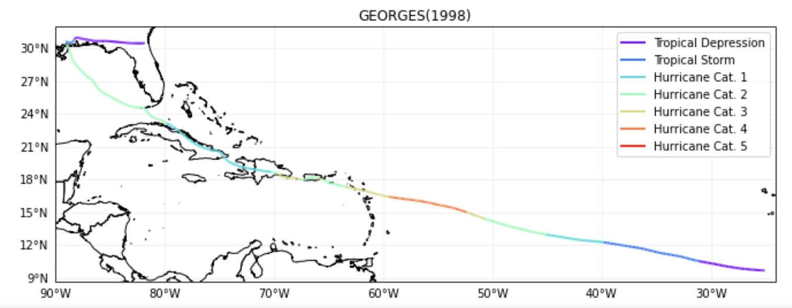
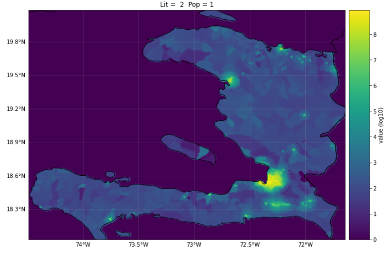
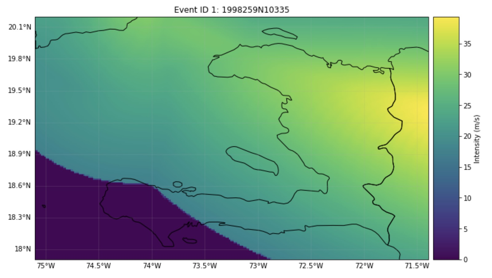
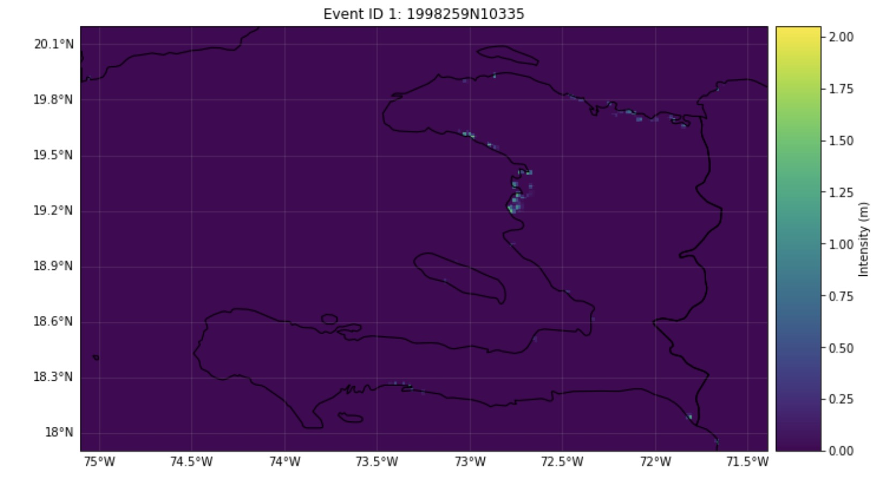
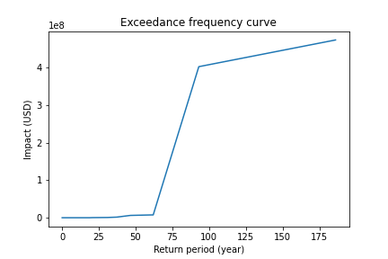
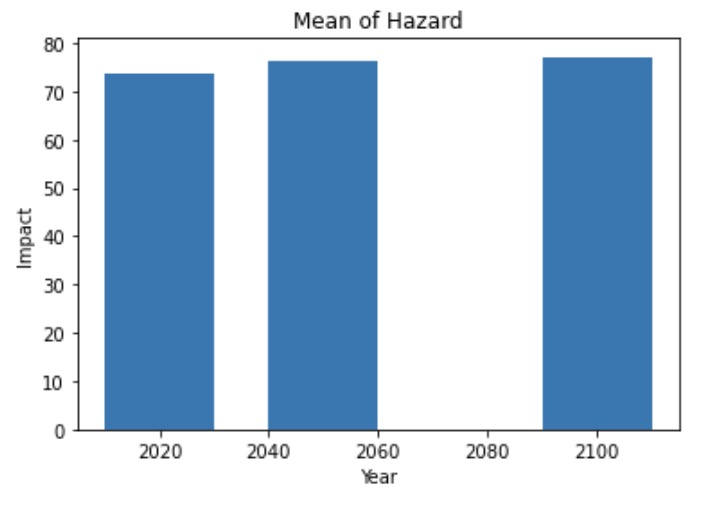
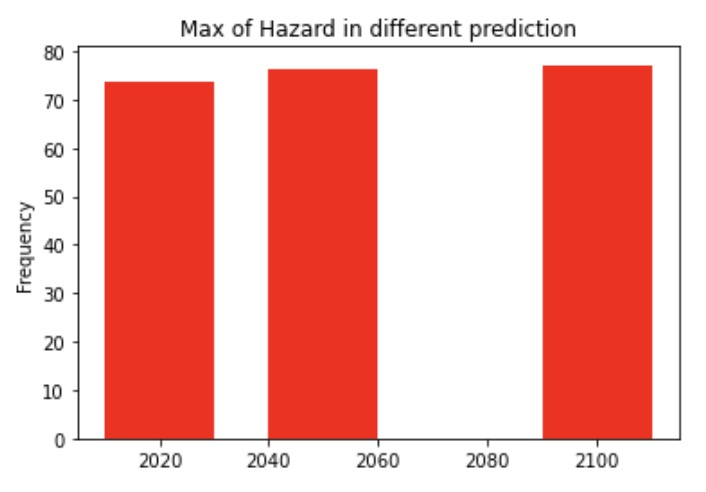

# Risk-Assessment

# About the Project
CLIMADA provides a model for calculating risk assessments on natural disasters. The methodology uses a combination of exposure of people and infrastructure based on opensource data, climate and weather disasters, and vulnerability of the exposed people and infrastructure (IPCC, 2014; Huizinga, et al., 2017). The methodology of impact assessments from natural disasters is done through the following steps: 
1.	Data Collection 
2.	Flood depth-damage functions
3.	Hazards 
4.	Maximum damage values
5.	Uncertainty and validation

Documentation on setup and runnnig CLIMADA is found at https://climada-python.readthedocs.io/en/stable/tutorial/1_main_climada.html

# Methodology

Neumann, et al., 2014 notes that storm surge and sea-level rise are events that necessitate better impact assessments on coastal areas. Models for these studies are based on tropical cyclone simulations, storm surge models, and models for economic impact and adaptation. Other methods use statistical analyses of past storm surges in a geographical area, GIS based analysis on population that is derived from opensource data such as OpenStreetMap and censuses, assessment of vulnerability based on economic losses on buildings, assessment of indirect losses such as reconstruction, and risk analysis of precautionary activities (Hallegatte, et al., 2010). To determine the populations that live below a certain elevation, Lidar or global digital elevation models are combined with settlement layers and census estimates for family members per household. Hallegatte, et al., notes that different building structures have different vulnerability indexes. Damage curves for residential buildings show a linear relationship between water depth and the damage factor (Huizinga, et al., 2017).

References

Neumann, J.E., Emanuel, K., Ravela, S. et al. Joint effects of storm surge and sea-level rise on US Coasts: new economic estimates of impacts, adaptation, and benefits of mitigation policy. Climatic Change 129, 337–349 (2015). https://doi.org/10.1007/s10584-014-1304-z

Hallegatte, S., Ranger, N., Mestre, O., Dumas, P., Corfee-Morlot, J., Herweijer, C., & Wood, R. M. (2011). Assessing climate change impacts, sea level rise and storm surge risk in port cities: a case study on Copenhagen. Climatic change, 104(1), 113-137.

Huizinga, J., De Moel, H., & Szewczyk, W. (2017). Global flood depth-damage functions: Methodology and the database with guidelines (No. JRC105688). Joint Research Centre (Seville site).

CLIMADA is separated into 4 functionalities: Entity, Hazard, Impact, and CostBenefit which are included in the following notebooks:
1.	LitPop for economic disaster risk based on gridded population data and nightlights.
2.	OSM_exposures for creating alternative exposure layers based on building footprint rather than LitPop.
3.	Haiti_WL for impact functions that relate the hazard intensity to damege in the exposure.
4.	Surge Bathtub for assessing the impact on the land from surge brought by strom wind. 
5.	TC Tracks Haiti and Tropical Cyclone + Climate Change which are obtained from the IBTrACS repository for historical tropical cyclones.
6.	Tracks for generating predicted tracks based on previous data
7.	Plot Cyclones for visualising the movement of the most severe tropical cyclones (Category = 5)

# Data Download

1. Haiti and Global GeoTiff 
Data source: 
Haiti Lidar Data: https://haitidata.org/  
Global Bathymetry Data: SRTM15+V2.0: https://figshare.com/projects/SRTM15_V2_0/62045
2. Merged Data:
Download from Google Drive: https://drive.google.com/drive/folders/1pNypaMg2vPqPtecGO-6yqspEXmRrM5bZ?usp=sharing;  
Save in the Data/Input folder after downloading 

# Function Examples:

# 1. Tropical Cyclone h5 and Plots

https://drive.google.com/drive/folders/129UdLWpBSdwsotVQJqp74835uT7SudDs?usp=sharing  
Example Track of Tropical Cyclone (GEORGES 1998):  
 

# 2. LitPop exposures  
https://github.com/SDG-AI-Lab/Risk-Assessment/blob/main/Data/Input/LitPop/LP_Haiti.7z  
  

# 3. Wind Impact of Tropical Cyclone
Wind of GEORGES(1998):   
  

# 4. TC Surge Bathtub  
Surge hazard was gennarated based on the tropical cyclone  
Surge hazard of GEORGES(1998):  
  

# 5. Impact Return Period Curve

# 6. Statistics Assessment of Predicted Tracks   
Mean Impact:  
   
Max Impact:  
   

